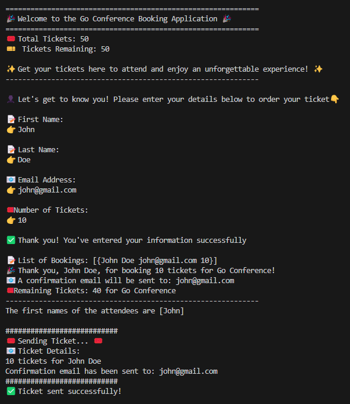
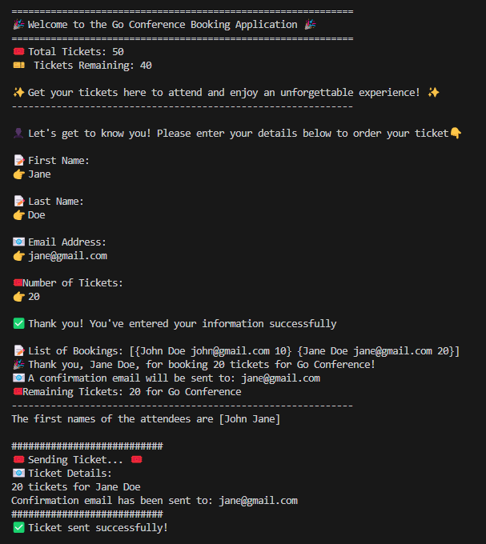
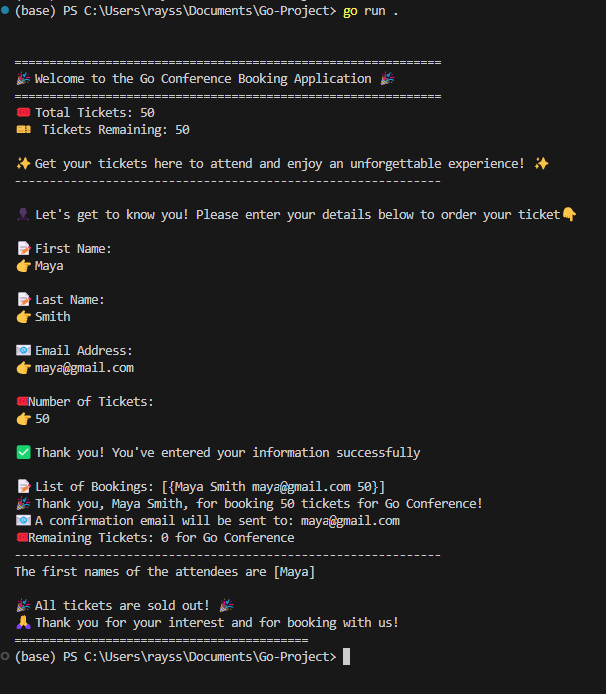

# Go-Project

This Go project is part of my course, **Pemrograman Berbasis Kerangka Kerja (D)**. The repository will be continuously updated as I follow the video tutorials provided by the YouTube channel linked with this course.

## Identity

- **Name:** Rayssa Ravelia  
- **NRP:** 5025211219  
- **Class:** Pemrograman Berbasis Kerangka Kerja (D)

---

## Project Overview

The project is based on a tutorial from the YouTube video: [Golang Tutorial for Beginners | Full Go Course by TechWorld with Nana](https://youtu.be/yyUHQIec83I?si=s1RoXRBlNdCXgo8g). The video is divided into two sections for clarity.

- **[Section 1:](https://github.com/rayrednet/Go-Project?tab=readme-ov-file#-section-1---introduction-to-go-0000---15402)** Introduction to Go, basic syntax, and control structures (00:00 - 1:54:02)
- **Section 2:** Functions and advanced topics (1:58:37 - 3:23:51)

You can follow each commit to see how the project evolves. View screenshots demonstrating the code output in each section.

---

## ⭐ Section 1 - Introduction to Go (00:00 - 1:54:02)

### Key Topics Covered:

1. **Introduction to Go**  
   - Overview of Go language and its advantages.
   
2. **Go Setup**  
   - Installation and setup of Go and the text editor.

3. **Basic Syntax & First Program**  
   - Structure of a Go file, writing the first program.

4. **Variables & Constants**  
   - Using variables and constants in Go.

5. **Formatted Output (printf)**  
   - Formatting and displaying output using `printf`.

6. **Data Types**  
   - Overview of Go data types.

7. **User Input**  
   - How to get user input using `fmt.Scan`.

8. **Pointers**  
   - Introduction to pointers in Go.

9. **Logic for Booking Tickets**  
   - Writing logic for booking tickets, using arrays and slices.

10. **Loops & Conditionals**  
    - Looping and conditionals with `if`, `else`, and `switch`.

11. **User Validation**  
    - Validating user input for names, email, and ticket count.

---

### Final Code for Section 1
This code below can be viewed in the `/main.go` file

```go
package main
import (
  "fmt"
  "strings"
)

func main() {
  conferenceName  := "Go Conference"
  const conferenceTickets uint = 50
  var remainingTickets uint = 50
  bookings := [] string{}

  fmt.Printf("Welcome to %v booking application\n", conferenceName)
  fmt.Printf("We have the total of %v tickets and %v are still available\n", conferenceTickets, remainingTickets)
  fmt.Println("Get your tickets here to attend")

  for {
      var firstName, lastName, email string
      var userTickets uint

      fmt.Println("Please enter your first name:")
      fmt.Scan(&firstName)

      fmt.Println("Please enter your last name:")
      fmt.Scan(&lastName)

      fmt.Println("Please enter your email:")
      fmt.Scan(&email)

      fmt.Println("Please enter the number of tickets you want to book:")
      fmt.Scan(&userTickets)

      isValidName := len(firstName) >= 2 && len(lastName) >= 2
      isValidEmail := strings.Contains(email, "@") && strings.Contains(email, ".")
      isValidTicketsNumber := userTickets > 0 && userTickets <= remainingTickets

      if isValidName && isValidEmail && isValidTicketsNumber {
        remainingTickets -= userTickets
        bookings = append(bookings, firstName+" "+lastName)

        fmt.Printf("Thank you %v %v for booking %v tickets for %v. You will receive a confirmation email at %v\n", firstName, lastName, userTickets, conferenceName, email)
        fmt.Printf("There are %v tickets remaining for %v\n", remainingTickets, conferenceName)

        firstNames := []string{}
        for _, booking := range bookings {
          var names = strings.Fields(booking)
          firstNames = append(firstNames, names[0])
        }
        fmt.Printf("The first names of the attendees are %v\n", firstNames)

        if remainingTickets == 0 {
          fmt.Println("All tickets are sold out. Thank you for booking!")
          break
        }
      } else {
        if !isValidName {
          fmt.Println("Invalid name. First and last name must be at least 2 characters long.")
        }
        if !isValidEmail {
          fmt.Println("Invalid email. Email must contain an '@' and '.'")
        }
        if !isValidTicketsNumber {
          fmt.Printf("Invalid number of tickets. Please enter a number between 1 and %v\n", remainingTickets)
        }
        continue
      }
  }
}
```

### Output Example:

- **Correct Input:**  
   - Two users, John and Jane, have booked tickets. The application shows a summary of the attendees' names after each booking.
   

- **Incorrect Input:**  
   - For incorrect inputs (e.g., name with less than 2 characters, invalid email, or exceeding available tickets), the application will display specific error messages and ask the user to try again.
   

---

### Summary of Section 1

In this section, we:
- Covered the basics of Go, including syntax, variables, and user input.
- Implemented logic for booking conference tickets.
- Added validation for user input, ensuring valid names, emails, and ticket numbers.

Further updates will be made as we progress through Section 2, which covers functions and more advanced Go topics.

## ⭐ Section 2 - Functions and Advanced Topics (1:58:37 - 3:23:51)

### Key Topics Covered

1. **Encapsulate Logic with Functions**  
   - To improve code readability and modularity, we encapsulate repetitive logic into functions. This helps break down tasks into reusable parts, allowing for cleaner and easier-to-maintain code.

2. **Organize Code with Go Packages**  
   - Packages enable us to organize code logically across files and directories, enhancing maintainability. Here, all functions have been moved to a helper package, improving separation of concerns by grouping related code in `helper.go`.

3. **Scope Rules in Go**  
   - Scope in Go defines the visibility and lifecycle of variables within blocks or functions, helping to avoid unwanted modifications or access. By understanding scopes, we efficiently manage variables in each function or package.

4. **Maps**  
   - Maps allow us to associate unique keys with specific values, enabling fast lookups. Here, maps facilitate user data organization by connecting names to other attributes like email and tickets.

5. **Structs**  
   - Structs in Go define custom data types, grouping related data under a single entity. In this project, we used `UserData` to encapsulate user booking details, making it easier to pass and manage structured data.

6. **Goroutines - Concurrency in Go**  
   - Goroutines enable concurrent execution of tasks, significantly enhancing application performance. Here, we used goroutines to send confirmation emails asynchronously while continuing with other tasks. Using `sync.WaitGroup` ensures goroutines complete before the program exits, leveraging `wg.Add(1)` to track tasks and `wg.Done()` when each task completes.

7. **Congratulations!**  
   - 🎉 Congratulations on completing the video! 🎉


### Final Code for Section 2

**main.go**  
Contains essential main code and controls the program flow.

```go
package main

import (
	"Go-Project/helper"
	"fmt"
	"sync"
)

const conferenceTickets uint = 50
var conferenceName  = "Go Conference"
var remainingTickets uint = 50

var wg = sync.WaitGroup{}

func main() {
  for {
	  helper.GreetUsers(conferenceName, conferenceTickets, remainingTickets)

		firstName, lastName, email, userTickets := helper.GetUserInput()
		isValidName, isValidEmail, isValidTicketsNumber := helper.ValidateUserInput(firstName, lastName, email, userTickets, remainingTickets)

		if isValidName && isValidEmail && isValidTicketsNumber {
			helper.BookTickets(userTickets, firstName, lastName, email, &remainingTickets, conferenceName)
			
			wg.Add(1)
			go helper.SendTicket(userTickets, firstName, lastName, email, &wg)

			firstNames := helper.GetFirstNames()
			fmt.Printf("The first names of the attendees are %v\n", firstNames)

			if remainingTickets == 0 {
				fmt.Println("\n🎉 All tickets are sold out! 🎉")
				fmt.Println("🙏 Thank you for your interest and for booking with us!")
				fmt.Println("==========================================")
				break
			}
		} else {
			fmt.Println()
			if !isValidName {
				fmt.Println("❌ Invalid Name: First and last name should be at least 2 characters long.")
			}
			if !isValidEmail {
				fmt.Println("❌ Invalid Email: Email should contain both '@' and '.' symbols.")
			}
			if !isValidTicketsNumber {
				fmt.Printf("❌ Invalid Ticket Number: Please enter a number between 1 and %v.\n", remainingTickets)
			}

			fmt.Println("🚫 Please correct the above errors and try again.")
		}
		wg.Wait()
	}
}
```

**helper/helper.go**  
Defines helper functions for input validation, booking, and ticket generation.

```go
package helper

import (
  "strings"
  "fmt"
  "time"
  "sync"
)

var bookings = make([]UserData, 0)

type UserData struct {
  FirstName string
  LastName string
  Email string
  NumberOfTickets uint
}

func GreetUsers(conferenceName string, conferenceTickets uint, remainingTickets uint) {
  fmt.Println("Welcome to the", conferenceName, "Booking Application!")
  fmt.Println("Total Tickets:", conferenceTickets, "Remaining:", remainingTickets)
}

func GetUserInput() (string, string, string, uint) {
  var firstName, lastName, email string
  var userTickets uint
  fmt.Scan(&firstName, &lastName, &email, &userTickets)
  return firstName, lastName, email, userTickets
}

func ValidateUserInput(firstName, lastName, email string, userTickets, remainingTickets uint) (bool, bool, bool) {
  isValidName := len(firstName) >= 2 && len(lastName) >=2
  isValidEmail := strings.Contains(email, "@") && strings.Contains(email, ".")
  isValidTicketsNumber := userTickets > 0 && userTickets <= remainingTickets
  return isValidName, isValidEmail, isValidTicketsNumber
}

func BookTickets(userTickets uint, firstName, lastName, email string, remainingTickets *uint, conferenceName string) {
  *remainingTickets -= userTickets
  bookings = append(bookings, UserData{FirstName: firstName, LastName: lastName, Email: email, NumberOfTickets: userTickets})
}

func SendTicket(userTickets uint, firstName, lastName, email string, wg *sync.WaitGroup) {
  time.Sleep(10 * time.Second)
  fmt.Println("Ticket sent to", email)
  wg.Done()
}
```
### Implementation Details

In this section, we reorganized code by moving functions from `main.go` into `helper.go` for a more modular structure. Notably, while the tutorial only moved `ValidateUserInput`, all helper functions were relocated for better organization.

### Output Examples:

- **Correct Input and Multiple Bookings:**  
     
   In this example, John places an order for 10 tickets. The application processes the order and continues running, waiting for the next customer input. This behavior is implemented using a "for" loop that continues until all tickets are sold out.

     
   Following John's order, Jane requests 20 tickets. The system calculates the remaining tickets (50 - 10 = 40) and processes Jane's order. The booking list is automatically updated to display all current orders, as shown in the screenshot:
   ```
   List of Bookings: [
     {John Doe john@gmail.com 10}
     {Jane Doe jane@gmail.com 20}
   ]
   ```

- **Sold Out Scenario:**  
     
   To demonstrate the sold-out functionality, we have Maya attempting to purchase all remaining 50 tickets. Once all tickets are allocated, the system automatically breaks out of the booking loop and displays a sold-out message. This ensures no more orders can be placed once capacity is reached.

- **Incorrect Input Handling:**  
     
   This example shows how the system handles invalid inputs. When Ray attempts to submit an order with:
   - Incorrectly formatted name
   - Invalid email address
   - Number of tickets exceeding the remaining availability
   
   The system responds with specific error messages identifying what went wrong. Instead of terminating, the application continues to run, prompting the user to provide correct information. This validation loop ensures data integrity and proper user guidance throughout the booking process.

### Summary of Section 2

In this section, I enhanced the booking application by:
- Improving code structure through function encapsulation and proper package organization
- Implementing key Go concepts including scope rules, structs, maps, and concurrency
- Enhancing the CLI output for better readability

Notable differences from the original video tutorial:
- While the tutorial only moved `ValidateUserInput` to helper.go, I relocated all helper functions from main.go for better code organization
- Modified the struct implementation to be globally accessible by capitalizing field names:
  ```go
  type UserData struct {
      FirstName       string
      LastName        string
      Email          string
      NumberOfTickets uint
  }
  ```
  Unlike the tutorial which defined the struct locally in main()

This project has been an excellent hands-on experience for learning advanced Go concepts! I hope my implementation and modifications can help others in their Go programming journey as well.